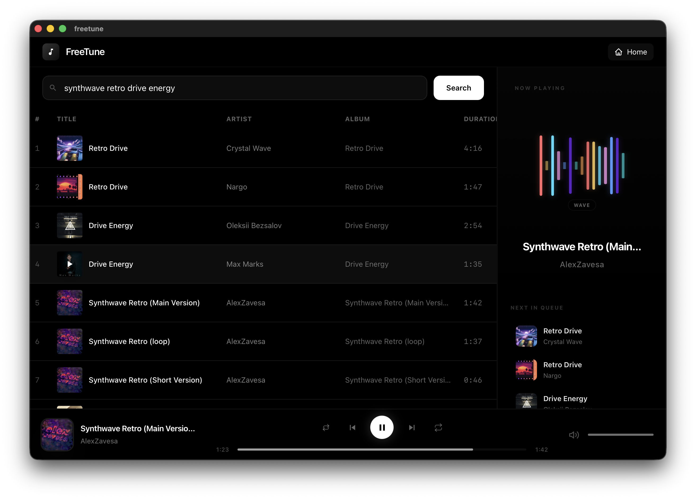
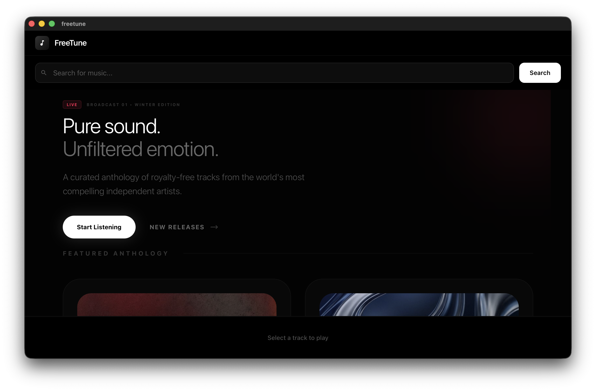

# FreeTune - Open Source Music Player

A lightweight, cross-platform desktop music player built with Tauri, React, and Rust that aggregates royalty-free music from various free sources.

## Features

- **Multi-source music search** - Search across Jamendo, Internet Archive, and other free music sources
- **Modern UI** - Clean, responsive interface built with React and Tailwind CSS
- **Audio Visualizer** - Beautiful animated visualizers with multiple color themes
- **Queue Management** - Play, reorder, and manage your playback queue
- **Playlists** - Create and save playlists locally
- **Small Bundle Size** - ~10MB compared to 150MB+ for Electron apps

## Screenshots




## Getting Started

### Prerequisites

- [Node.js](https://nodejs.org/) (v18+)
- [Rust](https://rustup.rs/) (latest stable)
- [Tauri CLI](https://tauri.app/v1/guides/getting-started/prerequisites)

### Installation

1. Clone the repository:
```bash
git clone https://github.com/yourusername/freetune.git
cd freetune
```

2. Install dependencies:
```bash
cd freetune
npm install
```

3. Configure API Keys (Optional):

FreeTune uses the Jamendo API for music search. You can use the default key for testing, or get your own:

- **Default**: The app includes a demo API key that works for testing
- **Custom**: Get your own free API key from [Jamendo Developer](https://developer.jamendo.com/v3.0)

To use a custom key, create a `.env` file in `freetune/src-tauri/`:
```bash
JAMENDO_CLIENT_ID=your_client_id_here
```

4. Run in development mode:
```bash
npm run tauri dev
```

5. Build for production:
```bash
npm run tauri build
```

## Music Sources

| Source | Description | API Required |
|--------|-------------|--------------|
| [Jamendo](https://www.jamendo.com) | 500k+ Creative Commons tracks | Yes (free) |
| [Internet Archive](https://archive.org) | Millions of free audio files | No |
| [MusOpen](https://musopen.org) | Classical music | No |

## Tech Stack

- **Frontend**: React 18, TypeScript, Tailwind CSS, Zustand
- **Backend**: Rust, Tauri v2
- **Audio**: Rodio
- **Database**: SQLite (via rusqlite)

## Project Structure

```
freetune/
├── src/                    # React frontend
│   ├── components/         # UI components
│   │   ├── Player/        # Audio player, visualizer, controls
│   │   └── Search/         # Search functionality
│   ├── stores/             # Zustand state management
│   └── services/          # Tauri API bindings
├── src-tauri/              # Rust backend
│   └── src/
│       ├── sources/        # Music API integrations
│       ├── audio/          # Audio playback engine
│       └── commands/       # Tauri IPC commands
└── README.md
```

## Contributing

Contributions are welcome! Please feel free to submit a Pull Request.

1. Fork the repository
2. Create your feature branch (`git checkout -b feature/amazing-feature`)
3. Commit your changes (`git commit -m 'Add some amazing feature'`)
4. Push to the branch (`git push origin feature/amazing-feature`)
5. Open a Pull Request

## License

This project is licensed under the MIT License - see the [LICENSE](LICENSE) file for details.

## Acknowledgments

- [Jamendo](https://www.jamendo.com) for providing the music API
- [Internet Archive](https://archive.org) for free audio collections
- [Tauri](https://tauri.app) for the excellent desktop framework
